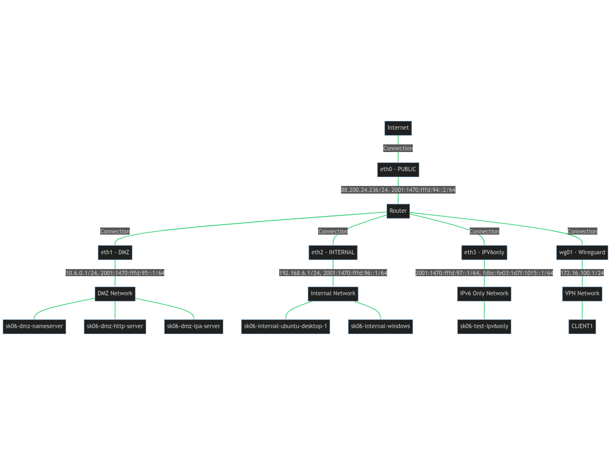
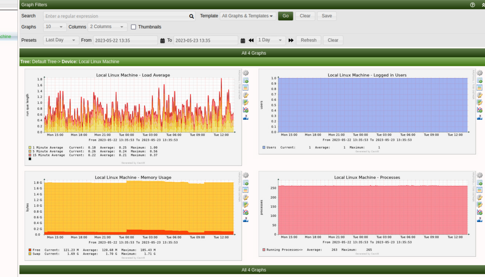

# TEHNICNO POROCILO

## Struktura omrezja



##  VYOS 
V tem odstavku obravnavamo podano konfiguracijo omrežne naprave z operacijskim sistemom VyOS. Podana konfiguracija vključuje več komponent, ki jih opisujemo v nadaljevanju.


### Osnovna konfiguracija
VyOS naprava se imenuje vyos in je konfigurirana z naslednjimi NTP strežniki za sinhronizacijo časa:

- 0.pool.ntp.org
- 1.pool.ntp.org
- 2.pool.ntp.org
Časovna cona naprave je nastavljena na UTC. Sistemski dnevnik je nastavljen tako, da zabeleži vse informacije in dnevnik protokolov na ravni razhroščevanja.

Za napravo je konfiguriran tudi uporabniški račun vyos z administrativnimi pravicami. Dostop do tega računa je mogoč z uporabo ključa za avtentikacijo SSH ali z geslom.

### Firewall konfiguracija
Firewall konfiguracija vključuje več pravil, ki uporabljajo različne metode za nadzor dostopa. Med temi pravili je omogočen ping (ICMP echo request), onemogočeni so usmerjevalni preusmeritve (redirects), omogočeno je beleženje "marsovcev" (martians - paketi s sumljivimi naslovi IP) in vključeni so SYN cookies za zaščito pred SYN flood napadi.
Za IPv6 je konfigurirano posebno pravilo (nptv6), ki sprejme vse povezane in povezane prometne podatke.
Obstajajo tudi pravila po meri, ki nadzirajo dostop do posameznih podomrežij. Ta pravila vključujejo `ALLOW_10_6_TO_192_NAMESERVER`, `ALL_TRAFFIC`, `OUTSIDE_LOCAL` in `WIREGUARD`.

### Konfiguracija vmesnikov
Konfigurirani so naslednji vmesniki:

- eth0: Javni vmesnik z naslovi IPv4 in IPv6.
- eth1: Vmesnik DMZ z naslovi IPv4 in IPv6.
- eth2: Interni vmesnik z naslovi IPv4 in IPv6.
- eth3: IPv6 samo vmesnik.
- wg01: Vmesnik WireGuard VPN.

Vsak vmesnik je konfiguriran z ustrezno IP naslovno shemo, strojno opremo ID, in po potrebi, pravila požarnega zidu.

Implementirali smo tudi SLAAC, pa DHCPv6 ter ipv6only omrezje.


## REST STREZNIK


Podpira naslednje HTTP metode: GET, POST, PUT in DELETE.

### GET

- GET `/users` vrača seznam vseh uporabnikov in njihovih sporočil. Odziv je odvisen od Accept glave, ki jo prejme, in podpira 'application/json', 'application/xml' in 'text/html'.
- GET `/users/<user_id>` vrača podrobnosti specifičnega uporabnika in njegova sporočila na podlagi podanega user_id. Odziv je odvisen od Accept glave, ki jo prejme, in podpira 'application/json', 'application/xml' in 'text/html'.
- GET `/messages` vrača seznam vseh sporočil. Odziv je odvisen od Accept glave, ki jo prejme, in podpira 'application/json', 'application/xml' in 'text/html'.
- GET `/messages/<message_id>` vrača podrobnosti specifičnega sporočila na podlagi podanega message_id. Odziv je odvisen od Accept glave, ki jo prejme, in podpira 'application/json', 'application/xml' in 'text/html'.

### POST
- POST `/users` sprejema JSON podatke novega uporabnika (ime in e-poštni naslov) in ga doda v zbirko. Vrne ID novega uporabnika.
- POST `/messages` sprejema JSON podatke novega sporočila (ID uporabnika in vsebina sporočila) in ga doda v zbirko. Vrne ID novega sporočila.

### PUT

- PUT `/users/<user_id>` sprejema JSON podatke, ki opisujejo, kako naj se uporabnik posodobi. Uporablja se, da se spremenijo podatki specifičnega uporabnika. Vrne število posodobljenih dokumentov.
- PUT `/messages/<message_id>` sprejema JSON podatke, ki opisujejo, kako naj se sporočilo posodobi. Uporablja se, da se spremenijo podatki specifičnega sporočila. Vrne število posodobljenih dokumentov.

### DELETE

- DELETE `/users/<user_id>` odstrani uporabnika na podlagi podanega user_id. Odziv je odvisen od Accept glave, ki jo prejme, in podpira 'application/json', 'application/xml' in 'text/html'.
- DELETE `/messages/<message_id>` odstrani sporočilo na podlagi podanega message_id. Vrne število izbrisanih dokumentov.

#### FREEIPA INTEGRACIJA
Ta Flask aplikacija uporablja knjižnico python_freeipa za avtentikacijo uporabnikov preko FreeIPA strežnika. 
V tej aplikaciji, ko se uporabnik poskuša prijaviti preko "/login" poti, aplikacija poskuša avtentikacijo s FreeIPA strežnikom z uporabo python_freeipa Client.login() metode. Ta metoda poskuša prijaviti uporabnika na FreeIPA strežnik z uporabniškim imenom in geslom, ki sta bila posredovana kot del zahtevka.
Če je avtentikacija uspešna, se ustvari odgovor, ki signalizira uspeh, in sejna piškotek, ki jo vrne FreeIPA strežnik, se posreduje nazaj stranki. Ta piškotek je nato uporabljena za preverjanje avtentikacije uporabnika za prihodnje zahteve.
Če je avtentikacija neuspešna, aplikacija vrne napako, ki jo vrne FreeIPA strežnik. To običajno pomeni, da uporabniško ime in geslo nista pravilna.
V razredu MessageAPI, metoda get() preveri, ali je bila sejna piškotek posredovana kot del zahtevka, in če ne, vrne napako 401, ki signalizira, da avtentikacija ni bila uspešna.
Opazimo lahko, da ta aplikacija trenutno ne izvaja avtentikacije na nobeni drugi točki v API-ju, kar pomeni, da lahko kateri koli uporabnik dostopa do drugih poti, kot so /users/<user_id> ali /messages/<message_id>, brez potrebe po avtentikaciji. To bi bilo treba popraviti za varno delovanje aplikacije.


### FREEIPA

V dmz coni sva postavila freeipa streznik. Na katerega se lahko prijavi admin kot `ipa.kp.org`. Username: `admin`, password: `admin12345`.

Uporabniki:

```bash
    - users: [
        { "name": "Tilen", "surname" : "Ozbot", "username": "tilen",  "password": "tilen12345" },
        { "name": "Gasper", "surname" : "Spagnolo", "username": "gasper",  "password": "gasper12345" },
        { "name": "Matjaz", "surname" : "Pancur", "username": "matjaz",  "password": "matjaz12345" },
        { "name": "Mojca", "surname" : "Ciglaric", "username": "mojca",  "password": "mojca12345" },
    ]
```


### SNMP



Cacti je odprtokodno omrežno orodje za nadzor in grafično predstavitev, napisano v PHP. 
Temelji na spletu in uporablja MySQL podatkovno bazo za shranjevanje vseh potrebnih informacij za ustvarjanje grafov in njihovo populacijo. 
Zmožen je anketirati omrežne naprave ter slediti porabi pasovne širine in jo zelo lepo graficirati. 
Uporablja protokol SNMP za pridobivanje informacij o oddaljenih napravah, vključno s stikali in usmerjevalniki.
Z Cacti lahko preko spletnega brskalnika nadzirate porabo pasovne širine in omrežni promet.

vir: https://www.howtoforge.com/how-to-install-cacti-monitoring-on-ubuntu-22-04/


### RAFT 

```bash
cd RAFT && docker-compose up -d
docker network inspect bridge
```

### Join node
```bash
curl --location --request POST 'localhost:2221/raft/join' \
--header 'Content-Type: application/json' \
--data-raw '{
	"node_id": "node_2", 
	"raft_address": "172.17.0.1:1112"
}'
```

### Check status
```bash
curl localhost:2221/raft/stats
```

### Get the key
```bash
curl --location --request GET localhost:2221/store/tilen
```

### Set the key
```bash
curl --location --request POST 'localhost:2221/store' --header 'Content-Type: application/json' --data-raw '{
        "key": "tilen",
        "value": "ozbot"
}'
```
